# Проектная работа «FindMe» (чат-бот ВК для поиска партнера по жизни)

## Описание проекта

### Цель проекта

Разработка чат-бота ВК, выводящего пользователю всех доступных потенциальных партнеров.

### Команда
- Казаков Борис (`GitHub`: [WhiteErMagic](https://github.com/WhiteErMagic 'Казаков Борис'), `VK`: [id24661232](https://vk.com/id24661232 'Казаков Борис'))
- Терлецкий Максим (`GitHub`: [maxter9595](https://github.com/maxter9595 'Терлецкий Максим'),`VK`: [id218879134](https://vk.com/id218879134 'Терлецкий Максим'))
- Алексеева Мария (`GitHub`: [1FiCuS1](https://github.com/1FiCuS1 'Алексеева Мария'),`VK`: [pelmenpersik](https://vk.com/pelmenpersik 'Алексеева Мария'))

### Вводные параметры

Все параметры вводятся пользователем внутри самого приложения в формате анкеты.

Список параметров для заполнения анкеты:
- имя пользователя
- фамилия пользователя
- возраст
- пол
- город

Далее после ввода всех необходимых параметров будет проведен автоматический поиск партнера.

### Ожидаемый результат

Запуск чат-бота ВК, в процессе работы с которым пользователь может:
- пролистывать всех своих партнеров нажатием на кнопку "Далее"/"Назад"
- добавлять своих любимых партнеров в раздел "Избранное"
- убирать ненужных партнеров в "Черный список".

Все изменения фиксируются в базе данных PostgreSQL.

### Что следует сделать перед запуском программы?

Перед запуском кода следует удостовериться, что:
- заведен проект в IDE
- размещены все файлы в папке с проектом
- установлены все библиотеки, указанные в ```requirements.txt```

## Структура проекта

```
CheckBD/
├─ ABCCheckDb.py
├─ CheckDBORM.py
├─ CheckDBSQL.py
├─ StructureDBORM.py

Materials/
├─ Registration/
├── photo.png
├─ Schema/
├── schema.png

Repository/
├─ ABCRepository.py
├─ CardExceptions.py
├─ CardFavorites.py
├─ CardFind.py
├─ ORMRepository.py
├─ SQLRepository.py

VK/
├─ vk_messages.py
├─ VKService.py

.env
.gitignore

README.md
requirements.txt

Criteria.py
Result.py
User.py
main.py
```

## Схема БД


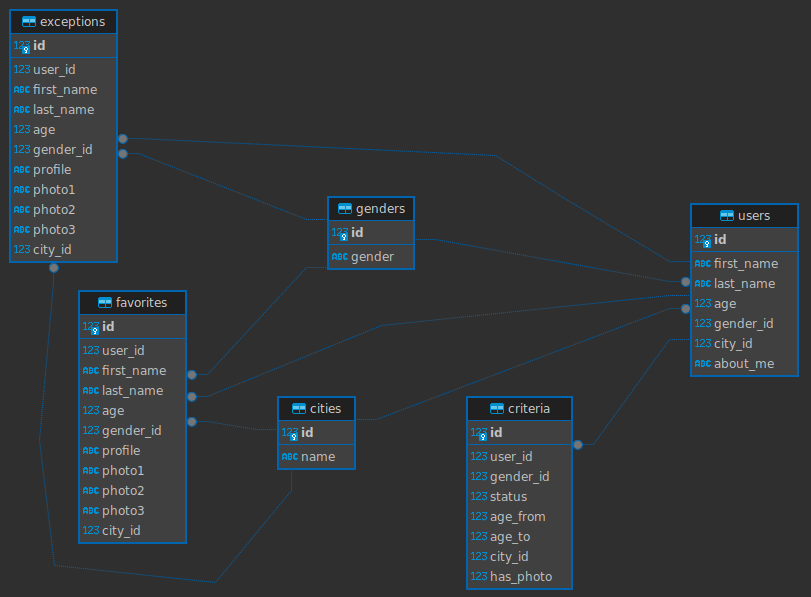


- **`criteria`**: таблица с критериями поиска относительно пользователя
  - `id`: ID критерия поиска
  - `user_id`: VK ID пользователя
  - `gender_id`: ID пола, относительно которого ищем партнера
  - `status`: ID статуса (женат, холост и т.д.) 
  - `age_from`: начальный возраст партнера, которого мы ищем
  - `age_to`: конечный возраст партнера, которого мы ищем
  - `city_id`: ID города партнера, которого мы ищем
  - `has_photo`: наличие фото у партнера (1 - есть фото, 0 - фото отсутствует)


- **`users`**: таблица с пользователями приложения
  - `id`: VK ID пользователя приложения
  - `first_name`: имя пользователя
  - `last_name`: фамилия пользователя
  - `age`: возраст пользователя
  - `gender_id`: ID пола пользователя
  - `city_id`: ID города пользователя
  - `about_me`: информация о пользователе


- **`genders`**: таблица с полами
  - `id`: ID пола
  - `gender`: наименование пола


- **`cities`**: таблица с городами
  - `id`: ID города
  - `gender`: наименование города


- **`favorites`**: таблица с избранными партнерами
  - `id`: id пары "партнер-пользователь"
  - `user_id`: VK ID пользователя
  - `first_name`: имя партнера
  - `last_name`: фамилия партнера
  - `age`: возраст партнера
  - `gender_id`: ID пола партнера
  - `profile`: профиль партнера в ВК
  - `photo1`: ссылка на фото партнера №1
  - `photo2`: ссылка на фото партнера №2
  - `photo3`: ссылка на фото партнера №3
  - `city_id`: ID города партнера


- **`exceptions`**: таблица с пользователями, добавленными в "Черный список"
  - `id`: id пары "партнер-пользователь"
  - `user_id`: VK ID пользователя
  - `first_name`: имя партнера
  - `last_name`: фамилия партнера
  - `age`: возраст партнера
  - `gender_id`: ID пола партнера
  - `profile`: профиль партнера в ВК
  - `photo1`: ссылка на фото партнера №1
  - `photo2`: ссылка на фото партнера №2
  - `photo3`: ссылка на фото партнера №3
  - `city_id`: ID города партнера

## Запуск программы

Для включения программы необходимо:


- заполнить все сведения в файле `.env`
  - `ACCESS_TOKEN`: токен сообщества ВК
  - `ACCESS_TOKEN_API`: токен пользователя ВК
  - `USER_NAME_DB`: логин пользователя Postgres
  - `USER_PASSWORD_DB`: пароль пользователя Postgres


- запустить модуль `main.py`


```dotenv
ACCESS_TOKEN='vk1...'
ACCESS_TOKEN_API='vk1....'
USER_NAME_DB='postgres'
USER_PASSWORD_DB='postgres'
```

## Инструкция по работе с чат-ботом ВК

### Регистрация


- После входа на страницу приложения:
  - вводим "start":
  - нажимаем на кнопку "хочу зарегистрироваться"
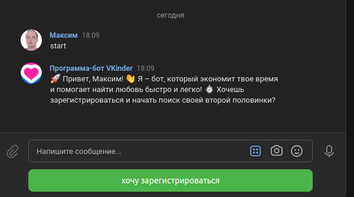
&nbsp;


- Далее вводим пользовательские данные и нажимаем на кнопку "Сохранить анкету"
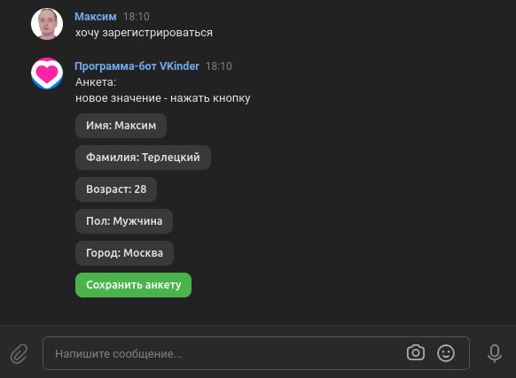
&nbsp;


- На следующем шаге вводим параметры нашего партнера и нажимаем на кнопку "Сохранить критерии"
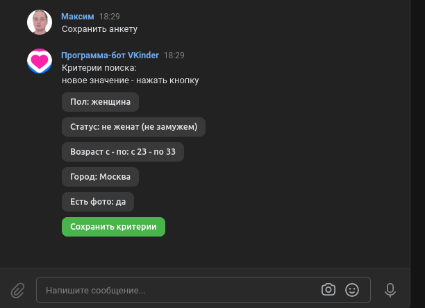
&nbsp;


- После этого мы окажемся в главном меню
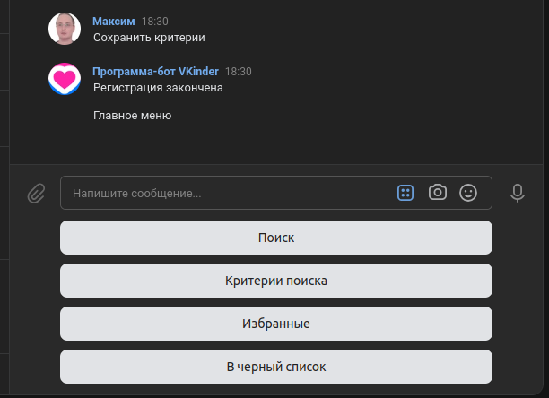
&nbsp;

---------------------

### Клавиша "Поиск"

- Нажимаем кнопку "Поиск"


-  После нажатия кнопки появится первая кандидатура, котрую мы можем пропустить, добавить в избранное или занести в черный список
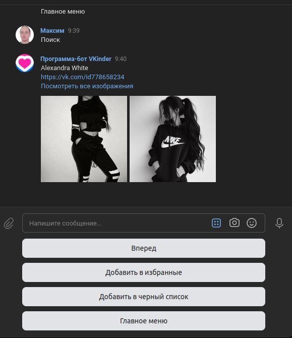
&nbsp;


-  Перейти к следующей кандидатуре можно нажатием на кнопку "Вперед". Для возрата к предыдущей кандидатуре следует нажать кнопку "Назад"
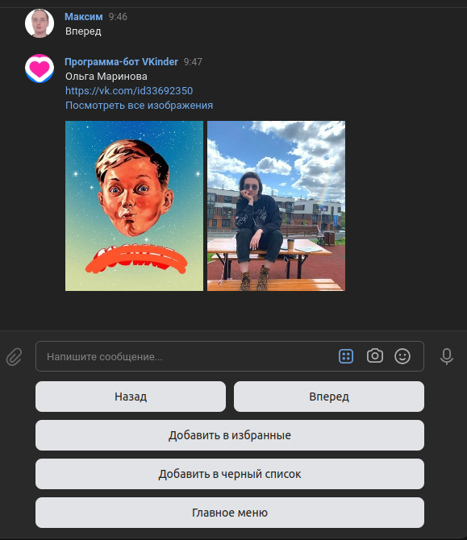
&nbsp;


- Добавить кандидата в избранное можно нажатием кнопки "Добавить в избранное"
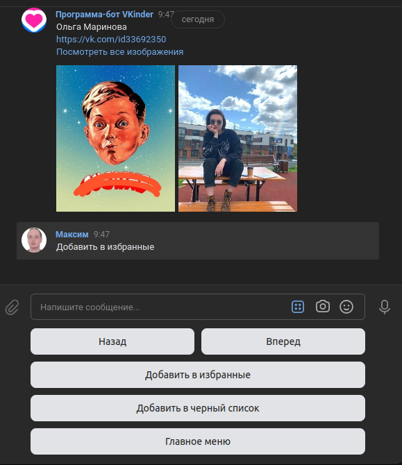
&nbsp;


- Добавление кандидата в черный список осуществляется нажатием кнопки  "Добавить в черный список"
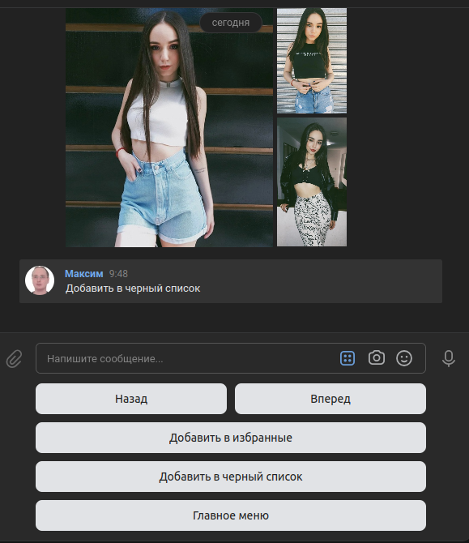
&nbsp;


- Возврат в главное меню осуществляется нажатием кнопки "Главное меню"
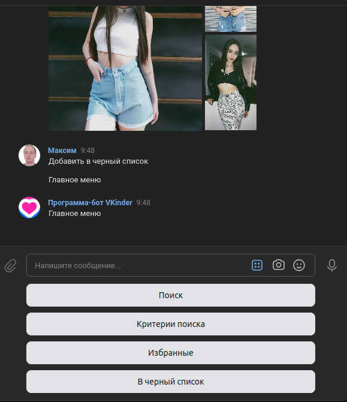
&nbsp;


---------------------

### Клавиша "Критерии поиска"

- Изменение критериев поиска можно осуществить после нажатия кнопки "Критерии поиска" в главном меню
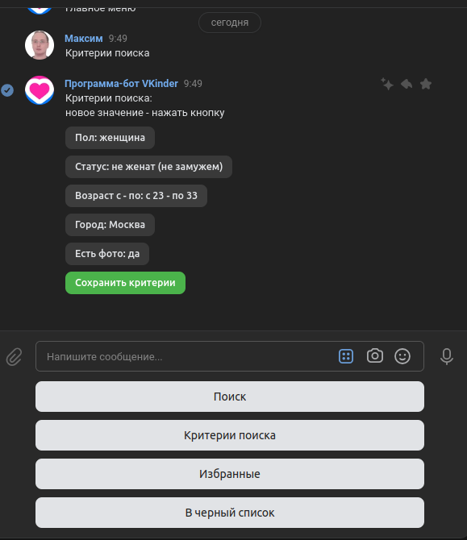
&nbsp;


---------------------

### Клавиша "Избранное"


- Просмотр всех избранных партнеров возможен после нажатия кнопки "Избранные"  
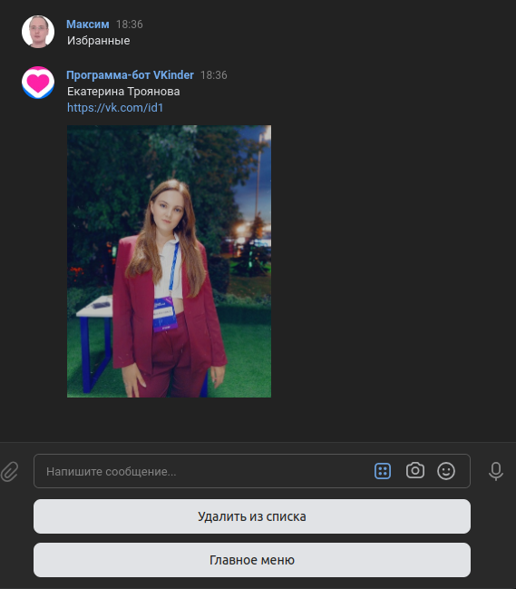
&nbsp;


---------------------

### Клавиша "В черный список"


- Просмотр всех партнеров из черноего списка возможен после нажатия кнопки "В черный список"  
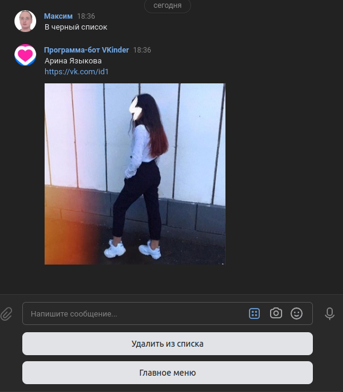
&nbsp;

